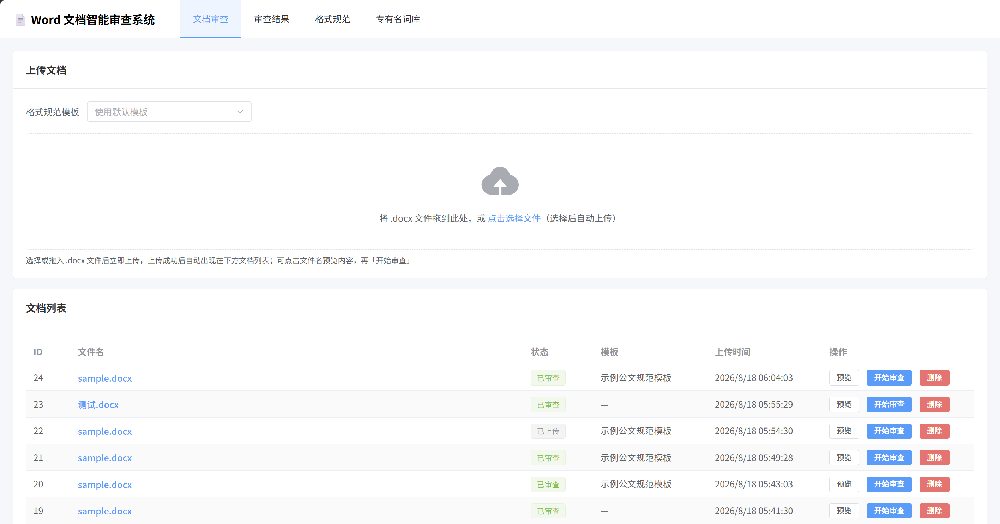
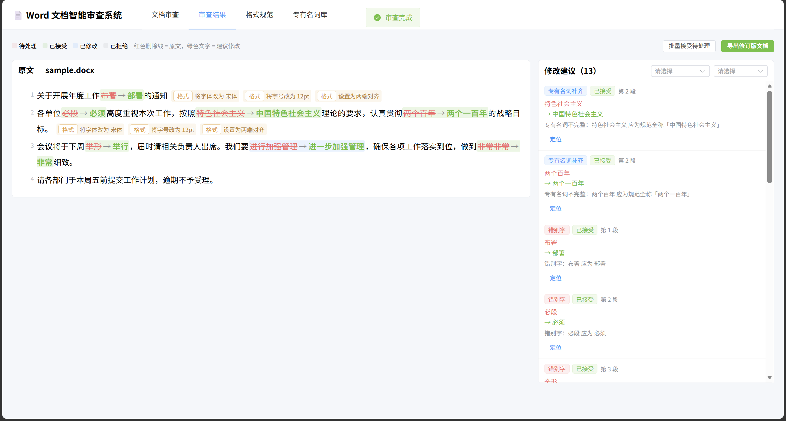

# Word 文档智能审查系统

基于大语言模型（LLM）的 Word 文档智能审查系统。

## 核心功能

1. **错别字审查**：错别字、标点误用、多字漏字等
2. **格式审查**：业务人员自定义格式规范（字体/字号/首行缩进/行距/对齐等），逐段比对
3. **专有名词补齐**：词库维护（全称 ↔ 简称），自动补全为规范全称
4. **句意优化**：语句不通、冗余、口语化等改写建议

每条建议支持 **接受 / 拒绝 / 自行修改**，确认后导出修订版。

## 技术栈

- 后端：FastAPI + Uvicorn + LangChain
- 数据库：SQLAlchemy 2.0 + Alembic（开发 SQLite → 生产 PostgreSQL，仅改连接串，见 require.md 5.5）
- 运行环境：**uv 标准项目工作流**（`pyproject.toml` + `uv.lock`）+ Python 3.14
- 文档处理：python-docx

## 快速开始

### 方式一：uv本地开发

```bash
# 1. 安装依赖
uv sync

# 2. 配置环境变量（不填密钥则自动用 mock 模式，可先体验全流程）
cp .env.example .env

# 3. 初始化数据库（建表，首次启动时执行）
uv run alembic upgrade head

# 4. 启动后端（接口文档 http://127.0.0.1:8000/docs）
uv run uvicorn app.main:app --reload --port 8000

# 5.（可选）另开终端启动前端开发模式，访问 http://localhost:5173
cd frontend
npm install
npm run dev
```

首次启动自动写入默认格式规范模板与内置专有名词。

### 方式二：容器化部署

```bash
# 1. 克隆仓库
git clone git@github.com:flashoutaa/documentai.git && cd doc-review

# 2. 配置环境变量（填 DEEPSEEK_API_KEY 走真实模型；留空则 mock 模式）
cp .env.example .env

# 3. 一键构建并启动（首次构建约几分钟）
docker compose up -d --build

# 4. 访问
# 前端页面：    http://localhost:8080
# 后端接口文档： http://localhost:8000/docs
# 体验：在「文档审查」页上传仓库自带的 examples/sample.docx
```

## 效果展示



## 接入真实 LLM

当前已配置 **DeepSeek**

如需切换：

```bash
LLM_PROVIDER=deepseek        # deepseek | openai | tongyi | ollama | mock
DEEPSEEK_API_KEY=sk-xxx      # 对应 provider 的密钥
```

未配置密钥时自动降级为 mock 模式（内置规则引擎）。

> 说明：DeepSeek 等 OpenAI 兼容 API 不支持 `response_format=json_schema`，
> 代码中已显式使用 `with_structured_output(..., method="function_calling")` 获取结构化输出。


### 数据持久化

- SQLite 数据库、上传的文档、导出的修订版都存放在 Docker 命名卷 `app_data`（挂载到容器内 `/app/data`），**容器重建不丢失**。

### 切换到 PostgreSQL（生产推荐）

```bash
docker compose -f docker-compose.yml -f compose.postgres.yml up -d --build
# 多出一个 postgres 容器，后端自动改用 PostgreSQL（业务代码零改动，见 require.md 5.5）
```

### 部署架构

```
浏览器
  │ :8080
  ▼
frontend 容器（Nginx）
  ├── 托管 Vue 静态页面（SPA）
  └── /api → 反向代理 → backend:8000
                           │
                           └── 数据卷 app_data（SQLite/上传/导出）
（可选）postgres 容器 ← DATABASE_URL 指向 ← backend
```

## 演示与测试

**克隆后立即体验**：仓库自带示例文档 `examples/sample.docx`，上传即可直观看到四类审查效果。


## 项目结构

```
app/
├── main.py                 # FastAPI 入口（CORS、生命周期、路由挂载）
├── core/                   # 配置（config.py）、数据库（database.py）
├── models/                 # 7 张表 ORM 模型
├── schemas/                # Pydantic 请求/响应模型
├── api/v1/                 # 路由：documents/templates/terms/tasks/suggestions
├── services/
│   ├── docx_parser.py      # docx 解析（文本 + 样式信息）
│   ├── docx_applier.py     # 导出修订版 docx
│   ├── chunker.py          # 长文本分块
│   └── review/             # LangChain 审查链 + 编排器
│       ├── provider.py     # 模型工厂（多供应商可切换）
│       ├── typo_chain.py   # 错别字链
│       ├── format_chain.py # 格式链（确定性规则引擎）
│       ├── term_chain.py   # 专有名词链（词库匹配）
│       ├── polish_chain.py # 句意优化链
│       └── orchestrator.py # 审查任务编排
└── scripts/                # seed / make_sample_docx / smoke_test
alembic/                    # 数据库迁移
data/                       # sqlite、上传、导出（gitignore）
```

## 关键接口

| 方法 | 路径 | 说明 |
|------|------|------|
| POST | /api/v1/documents/upload | 上传 docx（可指定规范模板） |
| GET | /api/v1/documents/{id}/preview | 预览文档内容（结构化段落文本+格式信息） |
| POST | /api/v1/tasks | 创建审查任务（选类型，后台异步执行） |
| GET | /api/v1/tasks/{id} | 任务状态与进度 |
| GET | /api/v1/tasks/{id}/review | 审查详情：原文全文 + 建议在原文中的精确字符位置（供内联对照展示） |
| GET | /api/v1/suggestions?task_id= | 建议清单（可筛类型/状态） |
| PATCH | /api/v1/suggestions/{id} | 接受/拒绝/自行修改 |
| POST | /api/v1/suggestions/batch | 批量处理 |
| POST | /api/v1/tasks/{id}/export | 导出修订版 docx |
| CRUD | /api/v1/templates、/api/v1/terms | 规范模板与专有名词库 |
